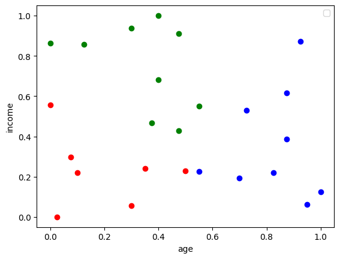
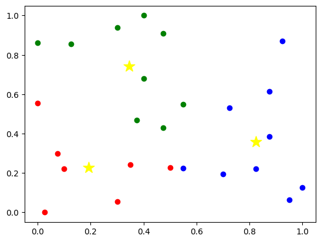

# K-Means Clustering

Welcome to the **K-Means Clustering** repository! This project demonstrates the implementation of the K-Means clustering algorithm to perform unsupervised learning tasks such as data segmentation and grouping. The repository contains the code, datasets, and explanations to help you understand and utilize K-Means clustering effectively.

---

## Table of Contents

1. [Overview](#overview)
2. [Features](#features)
3. [Installation](#installation)
4. [Usage](#usage)
5. [Dataset](#dataset)
6. [Results](#results)
7. [Contributing](#contributing)
8. [License](#license)

---

## Overview

K-Means clustering is a popular unsupervised machine learning algorithm used for partitioning a dataset into distinct clusters. Each cluster is represented by its centroid, and data points are assigned to the cluster with the nearest centroid. This repository provides a hands-on implementation of K-Means clustering and explores its application on real-world datasets.



---

## Features

- Implementation of K-Means from scratch.
- Visualization of clustering results.
- Analysis of optimal number of clusters using the **Elbow Method**.
- Support for custom datasets.

---

## Installation

1. Clone the repository:
   ```bash
   git clone https://github.com/sounakss7/K_means_clustering.git
   cd K_means_clustering
   ```

2. Install the required Python libraries:
   ```bash
   pip install -r requirements.txt
   ```

---

## Usage

1. Prepare your dataset or use the provided example datasets.
2. Run the script:
   ```bash
   python k_means.py
   ```
3. Adjust parameters like the number of clusters (k) and visualize the results.



---

## Dataset

The repository includes a sample dataset for demonstration purposes. You can replace it with your own dataset by following these steps:

1. Place your dataset file in the `data/` directory.
2. Update the file path in the script to point to your dataset.

---

## Results

- Visualizations of the clustered data.
- Metrics to evaluate the clustering performance.
- Insights on determining the optimal number of clusters.


---

## Contributing

Contributions are welcome! If you would like to contribute to this project:

1. Fork the repository.
2. Create a new branch for your feature or bugfix:
   ```bash
   git checkout -b feature-name
   ```
3. Commit your changes:
   ```bash
   git commit -m "Add a new feature"
   ```
4. Push to your branch:
   ```bash
   git push origin feature-name
   ```
5. Open a pull request.

---

## License

This project is licensed under the MIT License. See the [LICENSE](LICENSE) file for details.

---


